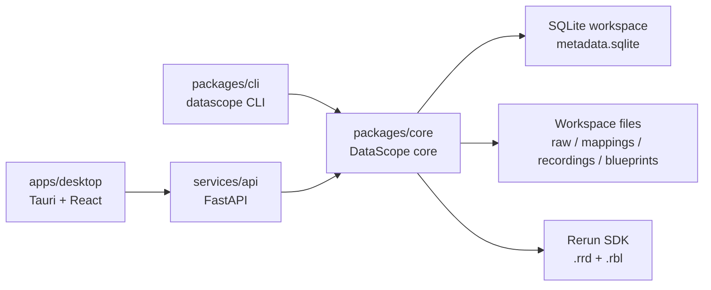

# DataScope Studio

DataScope Studio is a local-first desktop application for turning heterogeneous robotics,
industrial, and sensor datasets into inspectable Rerun recordings. It combines a Tauri +
React desktop shell, a FastAPI backend, a SQLite workspace catalog, Python adapters, and a
CLI into one repeatable import -> map -> convert -> visualize workflow.

## Features

| Area | Capability |
| --- | --- |
| Data import | CSV, JSONL, image folders with detection sidecars, point clouds (`PLY`, `PCD`, `NPY`, `NPZ`), and MCAP metadata |
| Visualization output | Rerun `.rrd` recordings plus `.rbl` blueprints |
| Local catalog | Projects, sources, streams, mappings, recordings, jobs, tags, params, query exports |
| Query workflows | Error search, low battery, detection failures, topic summary, state duration, time sync, compare |
| Extensibility | Local plugin manifests, template registry, batch import, project package export/import |
| User interfaces | Tauri desktop UI, FastAPI API, and `datascope` CLI |

## Architecture



## Repository Layout

| Path | Purpose |
| --- | --- |
| `apps/desktop/` | Tauri 2 desktop shell, React UI, Vite build, desktop scripts |
| `services/api/` | FastAPI application exposing project/source/mapping/recording/query endpoints |
| `packages/core/` | Python core package with adapters, inference, mapping, workspace, query, Rerun writers |
| `packages/cli/` | Typer-based `datascope` command line interface |
| `tests/` | Unit and integration tests plus small fixtures |
| `docs/` | Docsify documentation site |

## Quick Start

```bash
python3 -m venv .venv
. .venv/bin/activate
python -m pip install --upgrade pip
python -m pip install -r requirements-dev.txt

cd apps/desktop
npm install
npm run tauri:dev
```

The desktop script starts the local API automatically when `127.0.0.1:8000` is not already
healthy. For backend-only development:

```bash
. .venv/bin/activate
uvicorn datascope_api.main:app --reload --host 127.0.0.1 --port 8000
```

## CLI Examples

```bash
datascope inspect tests/fixtures/sample_sensor.csv
datascope import tests/fixtures/sample_sensor.csv --project demo --template sensor_monitor --out run_001
datascope recordings --project demo
datascope project export --project demo --out ~/DataScopeExports
```

## Validation

```bash
pytest -q
cd apps/desktop && npm run build
cd apps/desktop/src-tauri && cargo check
git diff --check
```

## Documentation

Open the documentation site locally:

```bash
cd docs
python3 -m http.server 4173
```

Then visit `http://127.0.0.1:4173/`.

## License

DataScope Studio is licensed under the Apache License, Version 2.0. See [LICENSE](LICENSE).
