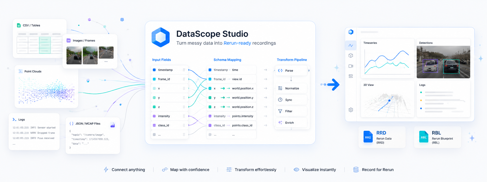

# DataScope Studio

[English](README.md) | [简体中文](README.zh-CN.md)



DataScope Studio turns robotics, industrial, and sensor datasets into interactive
[Rerun](https://rerun.io/) visualizations. Import local data, review the automatically
generated mapping, build a recording, and open it in Rerun without writing a custom
visualization script.

[Download DataScope Studio](https://github.com/MzKyle/DataScope-Studio/releases) |
[Read the documentation](docs/README.md)

## Quick Start

1. Download the installer for your platform from
   [GitHub Releases](https://github.com/MzKyle/DataScope-Studio/releases).
2. Launch **DataScope Studio**. The installed app starts the local API, Python runtime,
   and Rerun integration automatically.
3. On **Dashboard**, use **Quick Inspect**: drop a file or folder, or choose one from
   the system picker. No project setup is required for this first pass.
4. DataScope inspects the source, recommends a visual template, creates a draft mapping,
   validates it, and shows **Ready**, **Review**, or **Blocked** mapping readiness.
5. If the mapping is ready, select **Generate Visualization**. If review or fixes are
   needed, expand the advanced mapping editor, apply repairs, and validate again.
6. Select **Open in Rerun** to inspect the generated recording.
7. Create or open a **Project** when you want a persistent workspace for saved runs,
   project packages, batch imports, query history, tags, and exports.

The installer includes the desktop application, local API, Python runtime, DataScope
packages, and Rerun. Python, Node.js, npm, and Rerun do not need to be installed
separately for normal desktop use.

## What You Can Do

- Inspect heterogeneous data in one repeatable workflow.
- Automatically map timestamps, scalar values, states, logs, images, detections, and
  point clouds.
- Quickly inspect one local file or folder without adding a project to the workspace list.
- Generate reusable Rerun `.rrd` recordings and `.rbl` blueprints.
- Organize projects, sources, mappings, recordings, jobs, tags, parameters, and query
  exports locally.
- Search common conditions such as errors, low battery, detection failures, topic
  summaries, time sync issues, and state duration.
- Run offline robot diagnostics and export JSON, CSV, or HTML reports.
- Export and reopen complete DataScope project packages.

## Performance and Responsiveness

- The Tauri desktop app talks directly to the local FastAPI server first and only falls
  back to the Tauri proxy when direct requests fail, reducing normal API overhead.
- API startup warms the workspace in the background, so health checks and window startup do
  not wait for a full workspace scan.
- **Import & Auto Map** uses one import workflow request for adding the source, inspecting
  it, selecting templates, saving a draft mapping, previewing rows, and validating the
  mapping.
- **Quick Inspect** reuses the same import, mapping, validation, and conversion workflow
  inside an isolated temporary workspace, so the formal project list stays clean.
- Conversion jobs throttle progress writes to SQLite so large conversions do not spend
  excessive time updating job metadata.
- Query templates prefer the lightweight query index created during conversion and stream
  rows with limits where possible to reduce memory pressure on large projects.

## Supported Data

| Source | Examples | Typical Template |
| --- | --- | --- |
| Tables | CSV, JSONL/NDJSON | Sensor Monitor |
| Text tables and logs | TSV, TXT, LOG, DAT, LST, LIST with comma, tab, semicolon, pipe, or whitespace delimiters | Sensor Monitor |
| Computer vision | Image files or folders with optional `annotations.json` and `predictions.json` sidecars | CV Detection |
| Point clouds | PLY, PCD, NPY, NPZ, XYZ, XYZN, XYZRGB, PTS, ASC files or frame directories | Robotics Debug |
| Robotics recordings | MCAP and ROS2 DB3 bags, including split bag directories | Robotics Debug |

DataScope is local-first. Source data, mappings, recordings, and the SQLite catalog remain
in your local workspace unless you explicitly export a project package.

## Install

Download the installer for your computer from
[GitHub Releases](https://github.com/MzKyle/DataScope-Studio/releases).

The current source tree is `0.4.0` development. The latest public installer release is
`v0.3.1`; do not use `v0.4.0` installer names until that release has published assets.

| System | Download |
| --- | --- |
| Windows 10/11 x64 | `DataScope-Studio-v0.3.1-windows-x86_64-setup.exe` |
| macOS Apple Silicon | `DataScope-Studio-v0.3.1-macos-aarch64.dmg` |
| macOS Intel | `DataScope-Studio-v0.3.1-macos-x86_64.dmg` |
| Debian/Ubuntu x64 | `DataScope-Studio-v0.3.1-linux-amd64.deb` |
| Other Linux x64 | `DataScope-Studio-v0.3.1-linux-x86_64.AppImage` |

The `v0.3.1` packages are unsigned prerelease builds:

- **Windows:** if SmartScreen appears, choose **More info** and then **Run anyway** after
  confirming the installer came from this repository.
- **macOS:** drag DataScope Studio to Applications. On first launch, Control-click the app,
  choose **Open**, and confirm. You can also allow it under **System Settings > Privacy &
  Security**.
- **Linux AppImage:** make it executable before launching:

```bash
chmod +x DataScope-Studio-v0.3.1-linux-x86_64.AppImage
./DataScope-Studio-v0.3.1-linux-x86_64.AppImage
```

For the Debian package:

```bash
sudo apt install ./DataScope-Studio-v0.3.1-linux-amd64.deb
```

## Desktop Workflow

- **Dashboard:** quick-inspect a file or folder first, then open project packages or
  review recent recordings when working in a project.
- **Import Workflow:** review mapping readiness, expand advanced mapping only when
  needed, generate Rerun artifacts, and open them in Rerun.
- **Recordings & Queries:** reopen recordings, add tags, run query templates, export
  query results, compare scalar metrics, and inspect background jobs.
- **Diagnostics:** run offline robot health reports across all recordings or selected
  recordings, tune thresholds, and export reports.
- **Extensions & Settings:** install plugins/templates, run batch imports, export project
  packages, set default export and artifact folders, and inspect application logs.

For a headerless CSV, select **No header** and enter ordered column names such as
`timestamp,x,y,z,rx,ry,rz`. For TXT/LOG/DAT/LST sources, DataScope auto-detects table
delimiters when possible and falls back to a line-number plus message log view when the
file is unstructured.

## Files and Exports

Projects are stored under `~/.datascope-studio` by default. When no custom artifact
folder is set, recordings and blueprints are written to the project `recordings/` and
`blueprints/` folders. Set the **Rerun artifact folder** in Settings or the conversion
card to place the `.rrd` and `.rbl` files together somewhere else.

Use **Export Project Package** to create a portable `.datascope.zip` package. Reopen
existing packages from **Open Package** on the dashboard. Query and diagnostics exports
are written to the project `exports/` folder unless you choose a specific output path.

## CLI and Automation

The desktop app is the primary user interface. For scripted imports from a source
checkout or an environment where `datascope-cli` is installed:

```bash
datascope inspect tests/fixtures/sample_sensor.csv
datascope import tests/fixtures/sample_sensor.csv --project demo --out run_001
datascope import /path/to/run.mcap --project robot_demo --template robotics_debug --out robot_run
datascope recordings --project demo
datascope query --project demo --template low_battery --threshold 0.2
datascope diagnose --project robot_demo --preset strict --format html --out robot_diagnostics.html
datascope project export --project demo --out demo.datascope.zip
```

From a source checkout, create a development environment first:

```bash
python3 -m venv .venv
. .venv/bin/activate
python -m pip install --upgrade pip
python -m pip install -r requirements-dev.txt
```

Then start the development desktop app:

```bash
cd apps/desktop
npm install
npm run tauri:dev
```

## Documentation

- [Installation and packaging](docs/guide/package-install.md)
- [Import and conversion workflow](docs/workflow/import-convert.md)
- [Troubleshooting](docs/faq/troubleshooting.md)
- [Developer setup](docs/guide/run-app.md)
- [Architecture and API documentation](docs/architecture/README.md)

## License

DataScope Studio is licensed under the [Apache License 2.0](LICENSE).
