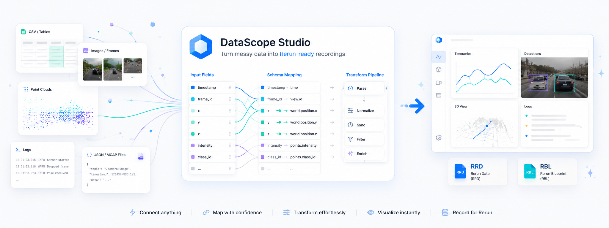

# DataScope Studio

DataScope Studio 是一个本地优先的数据可视化工作台，用来把 CSV、JSONL、图像检测数据、点云、MCAP 和 ROS2 DB3 bag 转换成 Rerun `.rrd` recording 与 `.rbl` blueprint，并在本地 SQLite catalog 中管理项目、recording、mapping、查询结果和导出包。

[下载桌面安装包](https://github.com/MzKyle/DataScope-Studio/releases)

## 适用场景

- 工业设备、机器人、传感器数据的本地检查与归档。
- 多源数据导入后快速生成 Rerun 可视化。
- 在本地对 run、tag、参数、查询结果做轻量 catalog 管理。
- 通过 CLI/API/桌面端复用同一套 import -> mapping -> convert 工作流。

## 当前能力

| 能力 | 说明 |
| --- | --- |
| 数据源 | CSV、JSONL、图像目录、点云文件/目录、MCAP、ROS2 DB3 bag |
| 映射 | 自动识别时间列、标量、状态、日志、图像、检测框、点云 |
| 输出 | Rerun `.rrd` 与 `.rbl` |
| Catalog | projects、sources、streams、mappings、recordings、jobs、query exports |
| 查询 | 低电量、错误日志、检测失败、topic summary、状态持续时间、时间同步 |
| 扩展 | 本地插件、模板 registry、批量导入、项目包导出/导入 |

## 快速导航

- [安装与打包](guide/package-install.md)
- [导入与转换](workflow/import-convert.md)
- [故障排查](faq/troubleshooting.md)
- [环境依赖](guide/prerequisites.md)
- [开发运行](guide/run-app.md)
- [架构总览](architecture/README.md)
- [HTTP API](interfaces/api.md)
- [CLI 命令](interfaces/cli.md)
