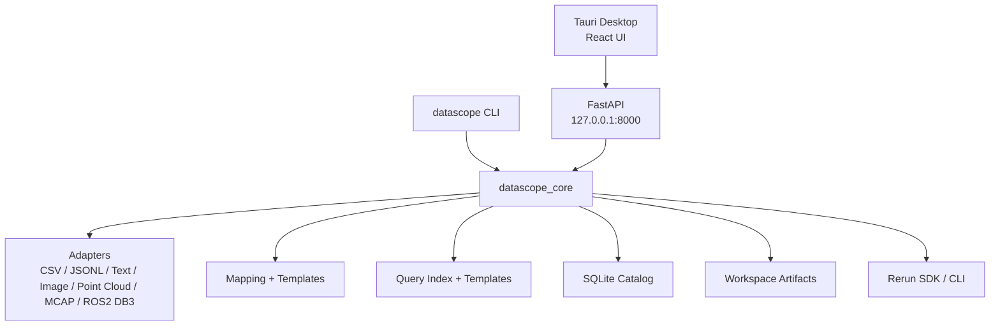

# 架构总览

DataScope Studio 按本地优先原则设计。桌面端、API、CLI 都复用同一个 `datascope_core` 包，核心状态落在本地 SQLite workspace 和项目目录中。

## 设计原则

- **本地优先**：默认不上传数据，workspace 在用户本机。
- **公共核心复用**：API 和 CLI 都调用 core，不复制业务逻辑。
- **显式 artifact**：原始副本、mapping、recording、blueprint、query export 都有可定位路径；recording 与 blueprint 也可写入用户指定目录。
- **可扩展**：adapter、template、plugin registry 是未来扩展入口。

## 主要边界

| 层 | 职责 |
| --- | --- |
| Desktop | 交互、文件/文件夹选择、状态展示 |
| API | HTTP 契约、错误包装、请求校验 |
| Core | 数据识别、workspace、mapping、转换、查询 |
| CLI | 自动化、本地脚本、批处理入口 |
| Rerun | recording 和 viewer |
