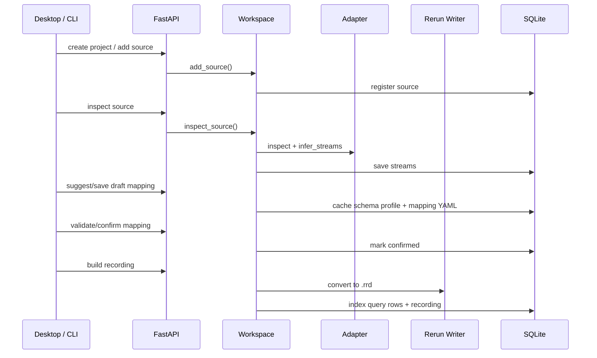

# 数据流

## 导入转换链路



桌面端常用的“导入并自动 Mapping”会走合并接口
`POST /api/projects/{project_id}/sources/import-workflow`。该接口一次完成 add source、
inspect、模板推荐、草稿 Mapping 保存、预览和校验，避免 UI 连续调用多个端点造成
重复等待。

## 性能关键路径

- API lifespan 只触发异步 workspace 预热；`/api/health` 不依赖完整 workspace
  初始化，桌面端冷启动更快。
- Tauri 前端缓存本地 API 端口，常规请求优先直接走 `fetch()`，直接请求失败时再回
  退到 Rust 侧代理。
- 项目 jobs 轮询支持 `limit` 和 `active_only` 查询参数；桌面端轮询时限制返回数量，
  避免历史任务过多时拖慢界面。
- 转换进度只在阶段变化、进度至少变化约 1%，或距离上次更新超过约 0.5 秒时写库，
  减少长任务中的 SQLite 写入压力。
- 表格转换和 query row 生成使用行元组迭代，查询读取使用 SQLite cursor 流式返回，
  避免把大批中间结果一次性放入内存。

## Workspace 文件流

项目目录包含：

```text
raw/          导入源文件副本
cache/        中间缓存
recordings/   .rrd
blueprints/   .rbl
mappings/     mapping YAML
logs/         运行日志
exports/      查询或项目导出
```

默认 workspace 为 `~/.datascope-studio`。项目 zip 导出默认进入 `~/DataScope Studio Exports`，避免藏在隐藏目录里。
