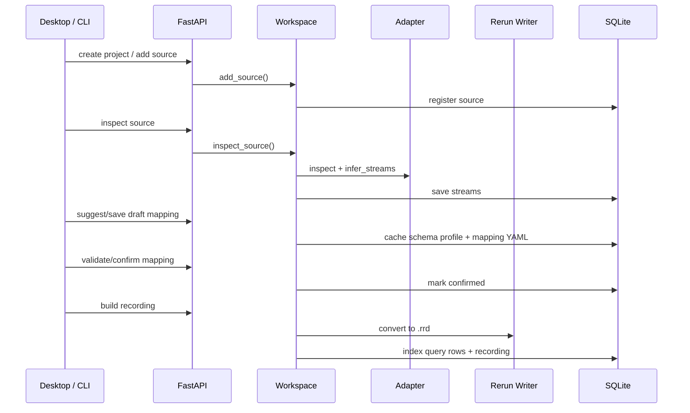

# 数据流

## 导入转换链路



## Workspace 文件流

项目目录包含：

```text
raw/          导入源文件副本
cache/        中间缓存
recordings/   .rrd
blueprints/   .rbl
mappings/     mapping YAML
logs/         运行日志
exports/      查询或项目导出
```

默认 workspace 为 `~/.datascope-studio`。项目 zip 导出默认进入 `~/DataScope Studio Exports`，避免藏在隐藏目录里。
